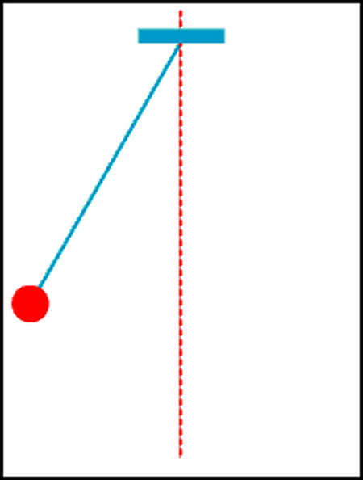

# Counting Rep - AI Club MiniGame
## Tóm tắt
Hãy thử tưởng tượng có 6 vật thể có 6 hình thù khác nhau được buộc vào 1 sợi dây và được tác động sao cho 6 vật thể này dao động đều (dao động với vận tốc không giảm theo thời gian).



Long đã đặt 8 máy quay ở 8 góc để quan sát số lần dao động của các vật thể này. Gọi số lần dao động là rep.

## Đề bài
Sử dụng kỹ năng phân tích dữ liệu, hãy đoán xem 6 vật thể này dao động bao nhiêu lần
- Input: tên file có dạng A-B-C.csv (cách nhau bởi dấu "-") với \
-- A: Tên vật thể \
-- B: Các góc quay quan trọng \
-- C: Số lần dao động được đếm trước để đối chiếu kết quả
- Output:
-- rep: là số lần dao động của vật thể đó. \
-- Lưu ý: KHÔNG SỬ DỤNG MACHINE/DEEP LEARNING.

## Yêu cầu:
Code dưới dạng hàm, bài nộp mẫu:
```python
# import thư viện cần thiết
# đọc file csv sử dụng pandas hoặc bất kì thư viện nào phù hợp
def rep_counting(df):
    # tính rep các kiểu
    return rep
```